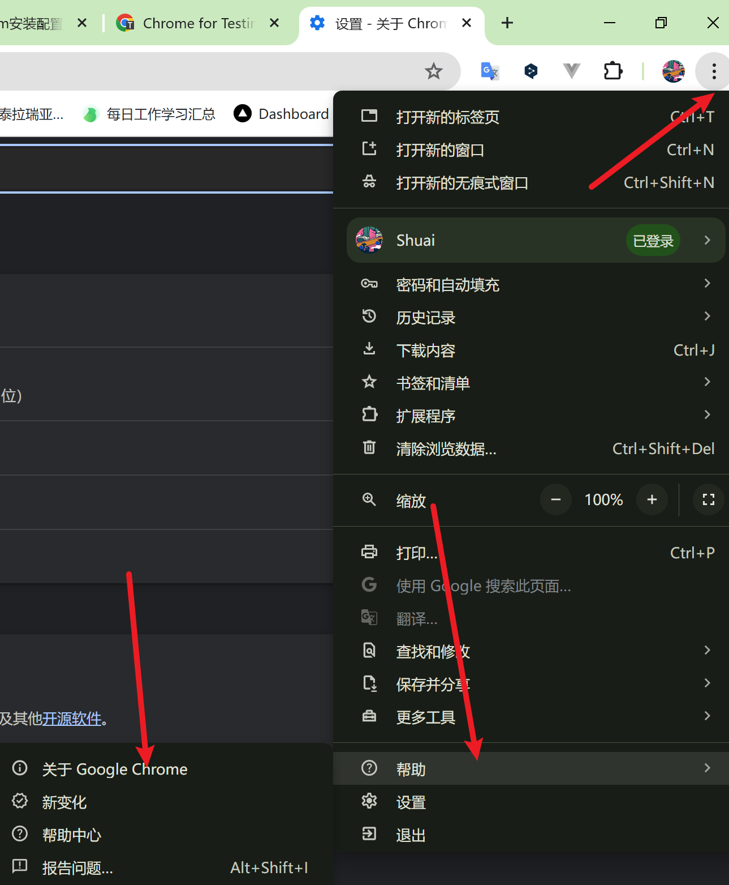
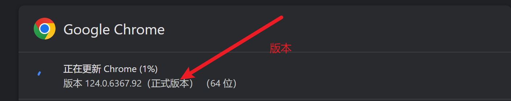
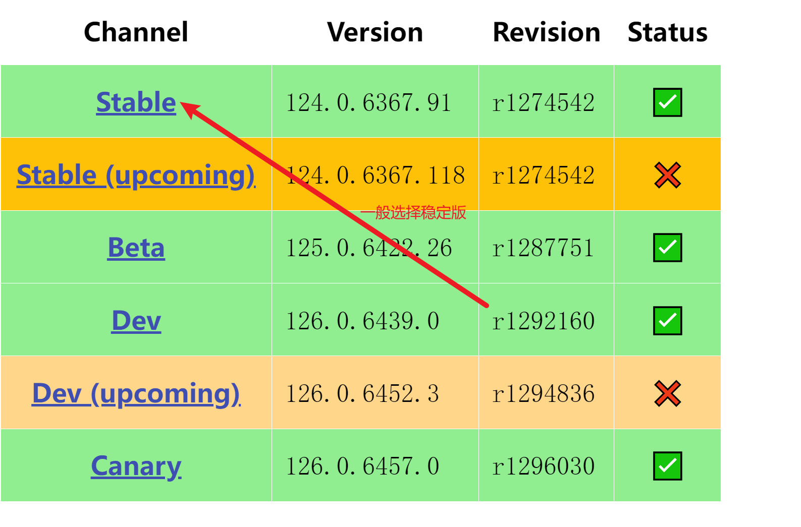
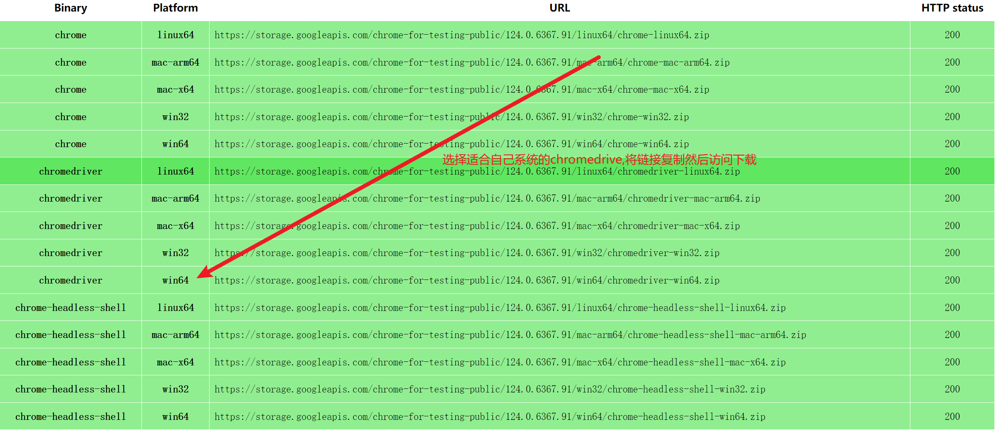
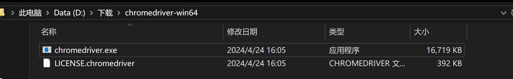
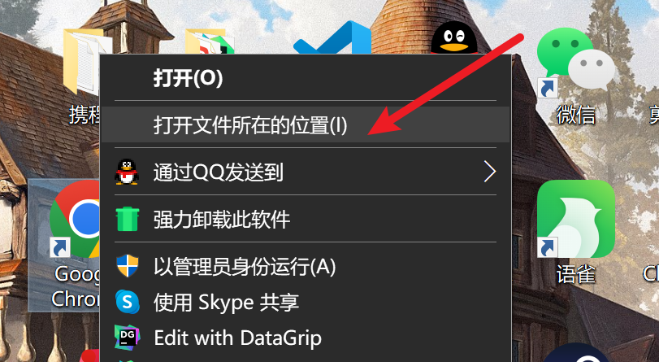
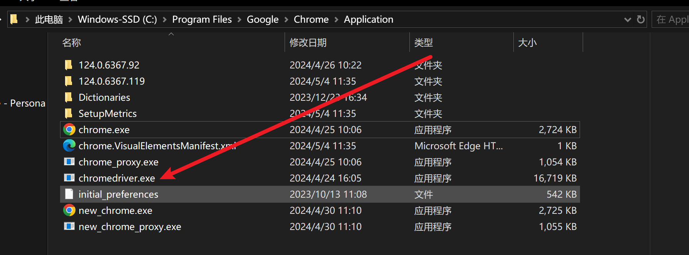

# 配置selenium

## 1、在Python虚拟环境中安装selenium模块

```shell
pip install selenium
```

## 2、下载版本符合的webdriver

以chrome谷歌浏览器为例  查看谷歌浏览器的版本  鼠标点击右上角的竖排的三个点，然后选择“帮助”，选择“关于 Google Chrome” ,进去之后即可查看谷歌浏览器的版本

 



访问下载chromedriver网站

访问[chromedriver下载地址1](https://registry.npmmirror.com/binary.html?path=chromedriver/)或[chromedriver下载地址2](https://link.csdn.net/?target=https%3A%2F%2Fgooglechromelabs.github.io%2Fchrome-for-testing%2F)，点击进入不同版本的chromedriver下载页面(一般最新地址在第二个链接)

以最新版本谷歌浏览器为例：



 


## 3、chromedriver环境配置的教程 

将压缩包解压，其包含文件如图：



将chromedriver.exe文件放在chrome目录下，其步骤如图：

右击谷歌浏览器图标，点击打开文件所在的位置：

直接将chromedriver.exe粘贴：

